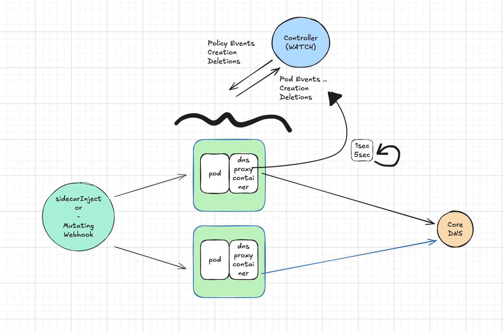
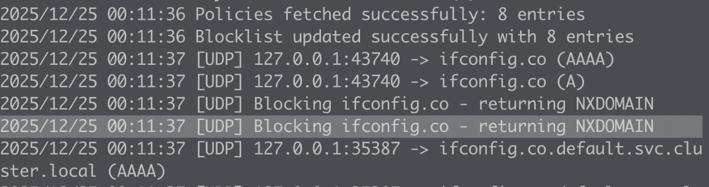

# DNS Mesh Controller :frog:

## Overview

DNS Mesh Controller is a Kubernetes operator that provides fine-grained DNS policy management for your workloads through automatic sidecar injection. It enables you to control which DNS queries are allowed or blocked at the pod level using Custom Resource Definitions (CRDs).

## What It Does

The DNS Mesh Controller automatically injects a sidecar DNS container into your pods using a mutating webhook. This sidecar acts as a local DNS proxy that enforces DNS policies defined through Kubernetes CRDs, allowing you to:

- **Control DNS Resolution**: Define allow and block lists for DNS queries
- **Selective Policy Application**: Target specific pods using label selectors or service accounts
- **Zero-Touch Integration**: Automatic sidecar injection without modifying pod specifications
- **Dynamic Policy Updates**: Update DNS policies without restarting pods
- **Dryrun Mode**: Test policies and monitor DNS usage without enforcing restrictions

## Architecture

The controller consists of three main components:

Here is the design details

</img>

1. **Mutating Webhook**: Automatically injects the DNS sidecar container into targeted pods

Mutating webhook project is located in another github repository <a href="https://github.com/WoodProgrammer/dns-mesh-sidecar-injector">dns-mesh-sidecar-injector</a>

You have to install it according to the `README.md` on itself then you guys can start to inject sidecar-dns pods on your deployment objects. (Please check the `README.md` file on that project)

2. **Controller Manager**: Watches DnsPolicy CRDs and reconciles the desired state
3. **DNS Sidecar**: Proxy injected into pods that enforces DNS policies

## Installation

### Prerequisites

- Kubernetes cluster v1.11.3 or higher
- kubectl configured to access your cluster
- Helm 3.x installed

### Deploy with Helm

Navigate to the `deploy` directory and install the Helm chart:

```bash
cd deploy/dns-mesh-controller
helm upgrade -i dns-mesh-controller -f values.yaml -n dns-mesh-controller-system --create-namespace .
```

This command will:
- Create the `dns-mesh-controller-system` namespace if it doesn't exist
- Deploy the controller manager
- Set up the mutating webhook
- Install the DnsPolicy CRD
- Configure necessary RBAC permissions

### Verify Installation

Check that the controller is running:

```bash
kubectl get pods -n dns-mesh-controller-system
kubectl get crd dnspolicies.dns.dnspolicies.io
```

## Usage

### Creating a DNS Policy

DNS policies are defined using the `DnsPolicy` custom resource. Here's an example:

```yaml
apiVersion: dns.dnspolicies.io/v1alpha1
kind: DnsPolicy
metadata:
  name: dnspolicy-sample
  namespace: default
spec:
  # Pods to apply this policy to
  targetSelector:
    app: frontend
  # Domains that are blocked (explicit deny)
  blockList:
  - '*.malicious-site.com'
  - 'tracking.ads.net'
  - 'www.google.com'
```

### Applying a Policy

Apply the sample policy provided in the repository:

```bash
kubectl apply -f ../sample-policy.yaml
```

Or create your own:

```bash
cat <<EOF | kubectl apply -f -
apiVersion: dns.dnspolicies.io/v1alpha1
kind: DnsPolicy
metadata:
  name: my-dns-policy
  namespace: default
spec:
  targetSelector:
    app: myapp
  blockList:
  - '*.ads.com'
  - 'telemetry.tracking.net'
EOF
```

### Policy Targeting

The DNS Mesh Controller supports two methods for targeting which pods should have policies applied:

#### Label-Based Targeting (targetSelector)

The `targetSelector` field uses label selectors to determine which pods should have the policy applied:

```yaml
spec:
  targetSelector:
    app: frontend
    tier: web
```

Only pods with matching labels will receive the DNS sidecar injection and policy enforcement.

#### ServiceAccount-Based Targeting (subject)

Target pods based on their ServiceAccount for identity-based policy management:

```yaml
spec:
  subject:
    serviceAccount: my-service-account
```

This approach provides more granular control by leveraging Kubernetes identity and is particularly useful for:
- Enforcing policies based on workload identity
- Integrating with RBAC and service mesh patterns
- Managing policies across multiple deployments sharing the same identity

### Dryrun Mode

Test your DNS policies without enforcing restrictions using dryrun mode. This is useful for:
- Understanding DNS usage patterns before enforcement
- Validating policy configurations in production
- Debugging DNS resolution issues

Enable dryrun mode in your policy:

```yaml
apiVersion: dns.dnspolicies.io/v1alpha1
kind: DnsPolicy
metadata:
  name: dnspolicy-dryrun-test
  namespace: default
spec:
  dryrun: true
  subject:
    serviceAccount: my-app
  blockList:
  - '*.ads.com'
```

In dryrun mode, the sidecar will log DNS queries that would be blocked but will not actually block them. Check the sidecar logs to see what would be affected:

```bash
kubectl logs <pod-name> -c dns-sidecar
```

### Allow and Block Lists

- **blockList**: Domains explicitly denied.

Both lists support:
- Exact domain matches: `api.example.com`
- Wildcard matches: `*.example.com`

## Configuration

### Helm Values

Customize the deployment by modifying `values.yaml` or providing override values:

```yaml
image:
  repository: docker.io/emirozbir/dns-mesh-controller
  tag: "latest"
  pullPolicy: IfNotPresent

resources:
  limits:
    cpu: 500m
    memory: 128Mi
  requests:
    cpu: 10m
    memory: 64Mi

service:
  type: ClusterIP
  port: 8443
  apiPort: 5959
```

## How It Works

1. **Pod Creation**: When a pod is created with labels matching a DnsPolicy's targetSelector
2. **Webhook Intercepts**: The mutating webhook intercepts the pod creation request
3. **Sidecar Injection**: The webhook modifies the pod spec to include the DNS sidecar container
4. **Policy Enforcement**: The sidecar proxies DNS queries and enforces the allow/block rules
5. **DNS Resolution**: Allowed queries are forwarded; blocked queries are rejected

## Common Use Cases

### Restrict External Dependencies

Prevent pods from accessing unnecessary external services:

```yaml
spec:
  targetSelector:
    app: backend
  blockList:
  - '*'  # Block all other domains
```

### Block Tracking and Ads

Prevent telemetry and tracking for compliance:

```yaml
spec:
  targetSelector:
    environment: production
  blockList:
  - '*.tracking.com'
  - '*.analytics.io'
  - 'telemetry.*'
```

### Security Isolation

Limit DNS resolution for sensitive workloads:

```yaml
spec:
  targetSelector:
    security: high
```

### Identity-Based Policy with Dryrun

Test DNS policies for specific service accounts before enforcement:

```yaml
apiVersion: dns.dnspolicies.io/v1alpha1
kind: DnsPolicy
metadata:
  name: payment-service-policy
  namespace: production
spec:
  dryrun: true
  subject:
    serviceAccount: payment-processor
  blockList:
  - '*'  # Block all others (in dryrun, only logs)
```

This approach allows you to:
- Test policies on production workloads safely
- Understand actual DNS usage patterns
- Validate allow/block lists before enforcement
- Use Kubernetes identity (ServiceAccount) for fine-grained control

To verify the blocking works fine log messages of sidecar-dns should be like this;

</img>

## Troubleshooting

### Check Controller Logs

```bash
kubectl logs -n dns-mesh-controller-system -l control-plane=controller-manager
```

### Verify Webhook Configuration

```bash
kubectl get mutatingwebhookconfigurations
```

### Check Policy Status

```bash
kubectl get dnspolicies -A
kubectl describe dnspolicy <policy-name> -n <namespace>
```

### Verify Sidecar Injection

Check if the sidecar was injected into your pod:

```bash
kubectl get pod <pod-name> -o jsonpath='{.spec.containers[*].name}'
```

## Uninstallation

To remove the DNS Mesh Controller:

```bash
# Delete all DnsPolicy resources first
kubectl delete dnspolicies --all -A

# Uninstall the Helm release
helm uninstall dns-mesh-controller -n dns-mesh-controller-system

# Delete the namespace
kubectl delete namespace dns-mesh-controller-system
```

## Next Steps

- Review the [sample-policy.yaml](deploy/sample-policy.yaml) for more examples
- Customize DNS policies for your specific workloads
- Monitor DNS query patterns and adjust policies accordingly
- Integrate with monitoring systems for DNS policy violations

## License

Copyright 2025. Licensed under the Apache License, Version 2.0.
